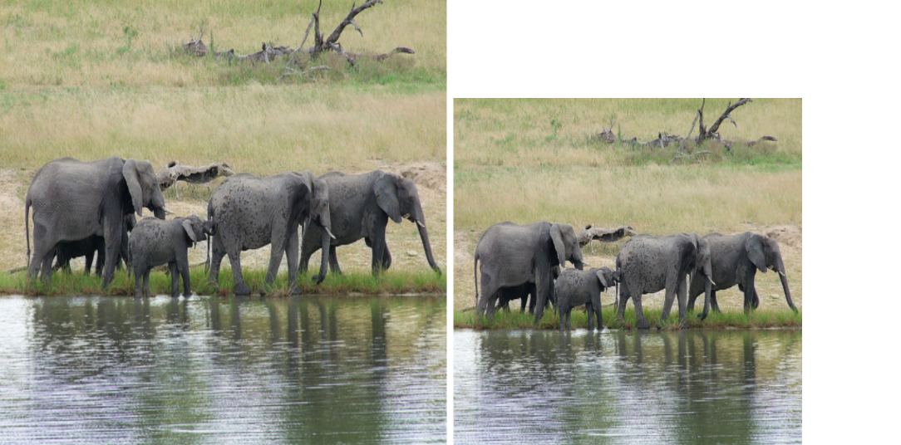

# Software Lab 

## Python Datascience Assignment

In this assignment we will deal with **Instance Segmentation and Detection**. Instance segmentation is a very well studied task of Deep Learning, having tremendous variety of applications. We are creating a python package for transforming images and analysing their effect on the predictions of an instance segmentor. 

The details of each of the files/folders are as follows:

1. `main.py`: This is the main file which is to be called to execute the program. The main file calls the corresponding functions as needed while execution. The main file should call the appropriate function to prepare the dataset, then transform the images read, obtain the segmentation masks and bounding boxes of the objects present in the image by calling the segmentor model, and then plot the obtained images by calling the appropriate functions from the package described below.

2. `./my_package/model.py`: This file contains the instance segmentation model definition. Consider it as a black-box model which takes an image (as numpy array) as input and provides the segmentation masks, bounding boxes as outputs and the corresponding class labels as for the input image.

&nbsp;
<p align="center">

</p>
<p align="center">
<b>Fig. 1</b>. Sample Output of the Segmentor. </p>
&nbsp;


3. `./my_package/data/dataset.py`: This file contains the class ```Dataset``` that reads the provided dataset from the annotation file and provides the numpy version of the images which are to be transformed and forwarded through the model. The annotation format is provided in `data/README.md`

4. `./my_package/data/transforms`: This folder contains 5 files. Each of these files is responsible for performing the corresponding transformation, as follows:
	
a) `crop.py`: This file takes an image (as numpy array) as input and crops it based on the provided arguments. Declare a class `CropImage()` for performing the operation. 

&nbsp;
<p align="center">

</p>
<p align="center">
<b>Fig. (a)</b>. Crop Operation. </p>
&nbsp;
	
b) `flip.py`: This file takes an image (as numpy array) as input and flips it based on the provided arguments. Declare a class `FlipImage()` for performing the operation. 

&nbsp;
<p align="center">

</p>
<p align="center">
<b>Fig. (b)</b>. Flip Operation. </p>
&nbsp;
	
c) `rotate.py`: This file takes an image (as numpy array) as input and rotates it based on the provided arguments. Declare a class `RotateImage()` for performing the operation. 

&nbsp;
<p align="center">

</p>
<p align="center">
<b>Fig. (c)</b>. Rotate Operation. </p>
&nbsp;

d) `rescale.py`: This file takes an image (as numpy array) as input and rescales it based on the provided arguments. Declare a class `RotateImage()` for performing the operation. 

&nbsp;
<p align="center">

</p>
<p align="center">
<b>Fig. (d)</b>. Rescale Operation. </p>
&nbsp;

e) `blur.py`: This file takes an image (as numpy array) as input and applies a gaussian blur to it based on the provided arguments. Declare a class `GaussBlurImage()` for performing the operation. 

&nbsp;
<p align="center">

</p>
<p align="center">
<b>Fig. (e)</b>. Blur Operation. </p>
&nbsp;

5. `./my_package/analysis/visualize.py`: This file defines a function that draws the image with the predicted segmentation masks and the bounding boxes (with the corresponding labels) on the image and saves them in the specified output folder.

6. `setup.py`: Use this file for constructing the package `my_package`.

we also designed a GUI using tkinter which would have the following overall functionality:

The GUI would provide the user to select a file from the computer.
It will have a dropdown menu to toggle between two output options: Segmentation and Bounding-box
If Segmentation is selected then it should show the segmentation map of the selected image file along with the original image file side-by-side.
For Bounding-box it should display the bounding boxes instead of the segmentation maps.
We will obtain the segmentation maps and the bounding boxes by taking help from the previous assignment (which you have already done).


## Coding Tasks

Note: For handling images, e.g. reading images, etc. we would use PIL

1. Writing the various transformations in `./my_package/data/transforms`.

2. The `Dataset` class in `./my_package/data/dataset.py` will accept the path to the annotation file and the list of transformation classes. Ideally you should be directly using transformation classes but you may also use strings to identify the transformations.

3. Writing a function `plot_visualization()` in `./my_package/analysis/visualize.py` that will draw the image with the predicted segmentation masks and bounding boxes (with the corresponding labels) on the images and save them in the output folder specified in the argument. Please note that you need to plot only the 3 most confident bounding boxes predicted by the segmentor. If the segmentor predicts less than 3 boxes, then plot all of them.

4. Create a python package ``` my_package```. 

5. Write ```main.py``` where you will test the different transformations you have written on the instance segmentor. The outputs for each of the experiments should be organized properly in the outputs folder. 

6. Write ImageViewerGUI.py: 

    Define the function fileClick: This function should pop-up a dialog for the user to select an input image file. Once the image is selected by the user, it should automatically get the corresponding outputs from the segmentor (call the segmentor from here). Once the output is computed it should be shown automatically based on choice the dropdown button is at.
    Define the function process: Should show the corresponding segmentation or bounding boxes over the input image wrt the choice provided. This function will just show the output, which should have been already computed in the fileClick function above. Also, you should handle the case if the user clicks on the Process button without selecting any image file.
    Complete the main function and add the required imports at the top.


## Analysis Tasks

1. Obtain and save the predicted bounding boxes for all the images provided in the `data/imgs` folder.

2. Consider the image with name same as the last digit of your roll number, i.e. if your roll number is 20CS####7 then consider the image `7.jpg` then plot the following using `subplots` in matplotlib and save them: 

	a) The original image along with the top-3 predicted segmentation masks and bounding boxes.

	b) Horizontally flipped original image along with the top-3 predicted segmentation masks and bounding boxes.

	c) Blurred image (with some degree of blurring) along with the top-3 predicted segmentation masks and bounding boxes.

	d) Twice Rescaled image (2X scaled) along with the top-3 predicted segmentation masks and bounding boxes.

	e) Half Rescaled image (0.5X scaled) along with the top-3 predicted segmentation masks and bounding boxes.

	f) 90 degree right rotated image along with the top-3 predicted segmentation masks and bounding boxes.

	g) 45 degree left rotated image along with the top-3 predicted segmentation masks and bounding boxes.


